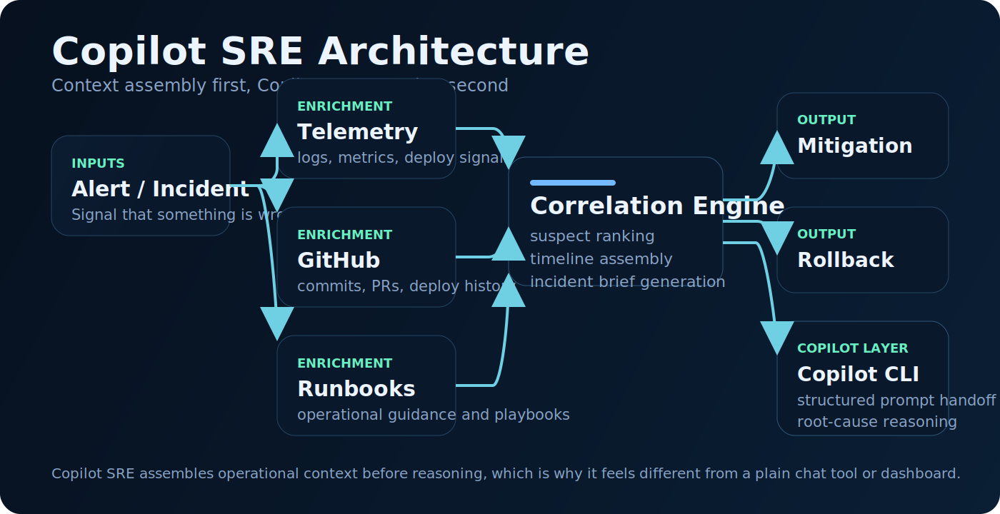
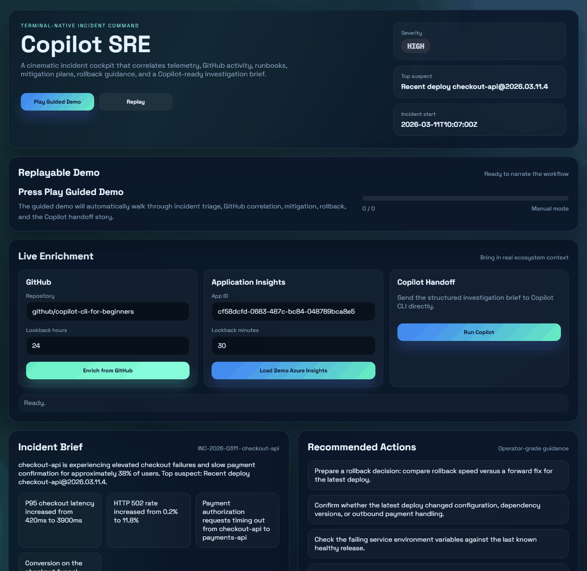
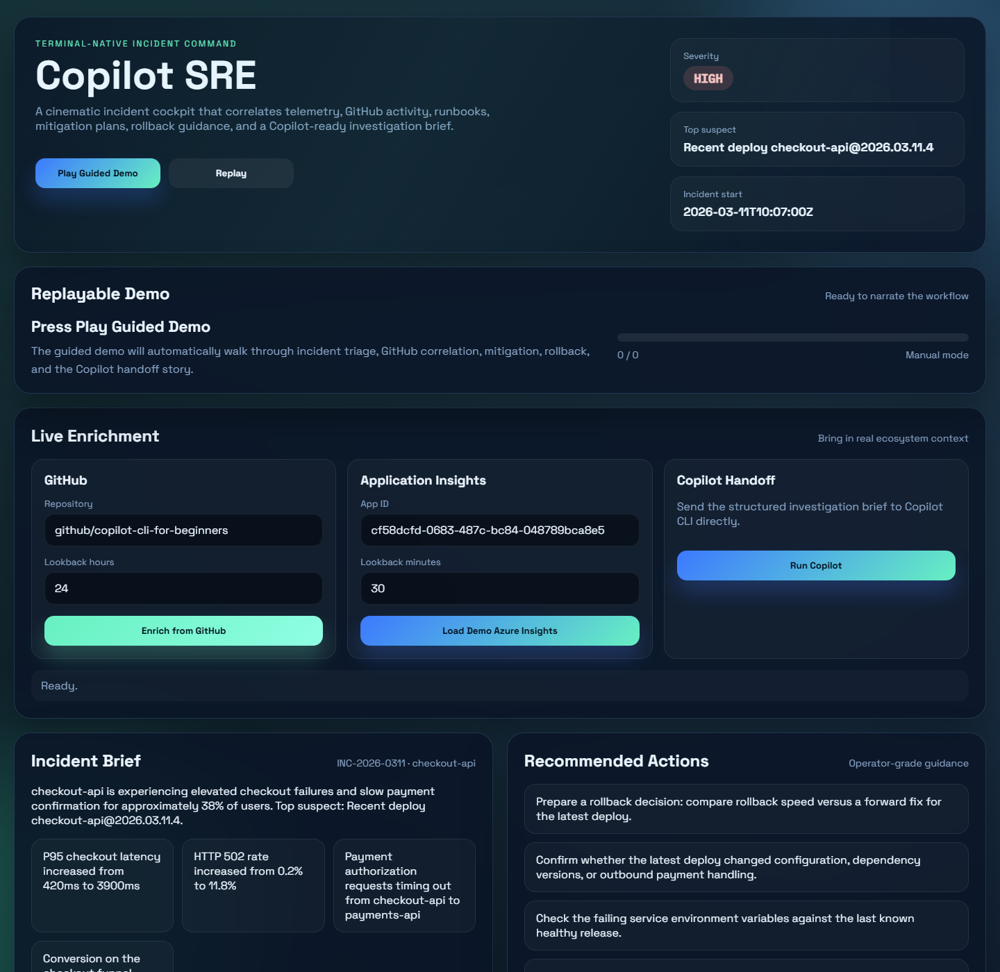
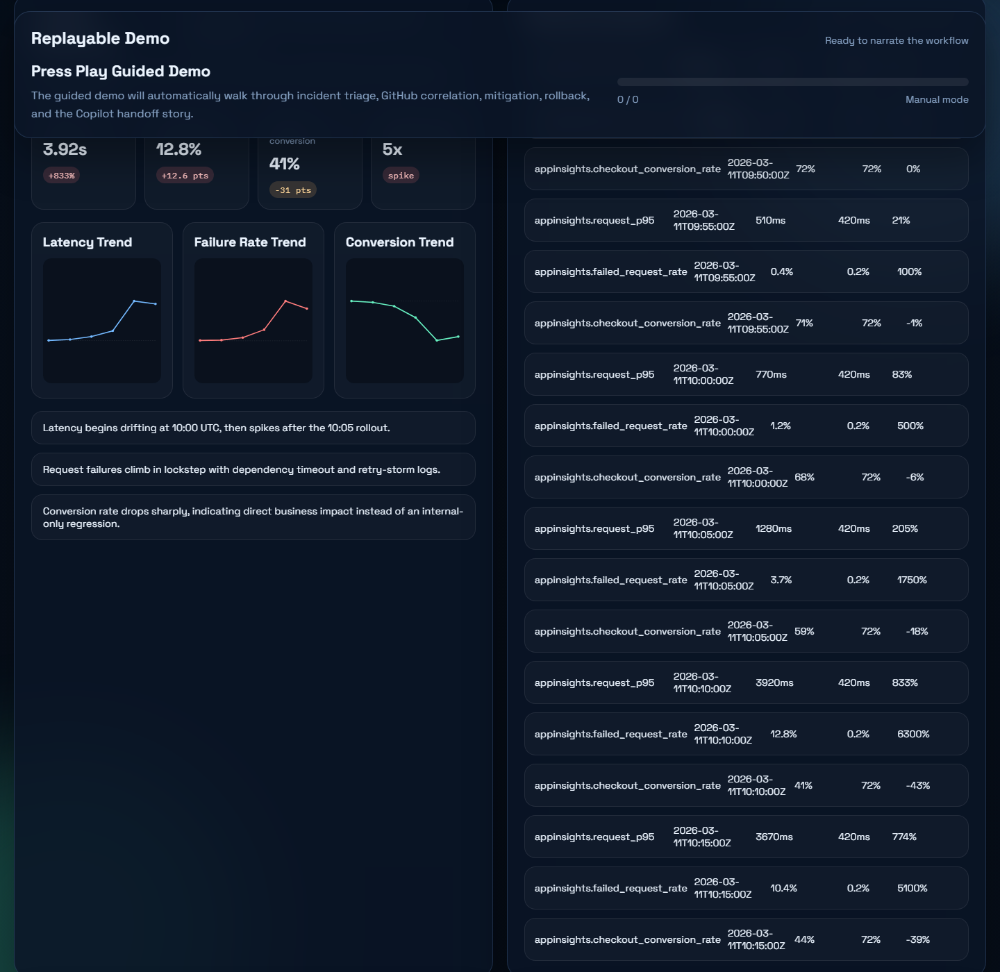

# Copilot SRE

Copilot SRE turns GitHub Copilot CLI into an incident commander.

It is an incident-response cockpit built on top of Copilot CLI that correlates telemetry, GitHub activity, runbooks, mitigation plans, rollback guidance, and a Copilot-ready investigation brief.

Instead of starting from a vague prompt during an outage, Copilot SRE assembles the evidence first and then hands Copilot a structured operational brief.

## Architecture overview



## Proof demo



## Dashboard screenshots

### UI overview



### App Insights dashboard view



## What it does

Copilot SRE collects incident context from deploy metadata, logs, metrics, alerts, runbooks, and repository activity, then turns that context into a structured SRE workflow:

- triage the incident
- rank likely root causes
- generate an investigation brief
- draft a Copilot CLI prompt with high-signal context
- optionally hand the prompt to `copilot`

## Why it is interesting

- It extends Copilot CLI instead of replacing it.
- It creates a natural GitHub + Azure story.
- It is operator-driven and easy to inspect during a live incident.
- It shows how Copilot can evolve from coding assistant to operational teammate.

## Relationship to GitHub Copilot CLI

Copilot SRE is a separate project built on top of GitHub Copilot CLI.

It does not modify, fork, or replace Copilot CLI. Instead, it prepares incident context and then optionally hands a structured operational brief to Copilot CLI for the final reasoning step.

The intended positioning is:

- built on top of GitHub Copilot CLI
- complementary to GitHub Copilot CLI
- an example of what can be built with Copilot CLI as an underlying reasoning layer

## Attribution

Copilot SRE relies on GitHub Copilot CLI as the underlying AI execution layer for optional prompt handoff.

If you publish this repository, a good short attribution line is:

> Built on top of GitHub Copilot CLI as the underlying incident-reasoning handoff layer.

## How it uses Copilot CLI

See [HOW_IT_WORKS_WITH_COPILOT_CLI.md](docs/HOW_IT_WORKS_WITH_COPILOT_CLI.md) for a dedicated explanation of how Copilot SRE prepares incident context and then hands the final investigation brief to GitHub Copilot CLI underneath.

## Why Copilot SRE

See [WHY_COPILOT_SRE.md](docs/WHY_COPILOT_SRE.md) for the product rationale: why it exists, how it differs from existing tools, how it helps developers and releases, and how it can integrate into CI/CD workflows.

## Why this matters

Copilot CLI is powerful, but incident response often starts with fragmented context:

- alerts in one tool
- logs in another
- deploy history elsewhere
- runbooks hidden in docs
- tribal knowledge in chat

Copilot SRE compresses that into one command so Copilot starts with evidence, not guesswork.

## Why this is different

Copilot SRE is not:

- just another dashboard
- just a chatbot for logs
- just a postmortem generator

It is a context assembly and operational reasoning layer for incidents.

That means it does something different from typical tools:

- observability tools show telemetry
- GitHub shows code and release activity
- runbooks show human guidance
- Copilot CLI provides reasoning

Copilot SRE connects all four into one workflow.

## Evaluation

See [EVALUATION.md](docs/EVALUATION.md) for suggested product-proof metrics such as time to first root-cause hypothesis, time to mitigation recommendation, incident brief completeness, rollback guidance quality, and reduction in context switching.

## Measured impact / evaluation plan

This project should ultimately be judged by whether it improves real incident handling, not just whether it looks good in a demo.

The key metrics to evaluate are:

- time to first plausible root-cause hypothesis
- time to mitigation recommendation
- time to rollback decision
- reduction in context switching
- completeness of the generated incident brief
- quality of rollback guidance

The full evaluation framework is in [EVALUATION.md](docs/EVALUATION.md).

## Launch the UI demo

Run this from the project root:

```bash
python -m copilot_sre ui --incident samples/incident-001 --host 127.0.0.1 --port 8765
```

Then open:

- `http://127.0.0.1:8765`

Once the UI opens, click `Play Guided Demo` to run the replayable walkthrough automatically.

The Application Insights field is preloaded with a demo app id:

- `cf58dcfd-0683-487c-bc84-048789bca8e5`

This is used as a built-in demo mode for rich telemetry dashboards. When you provide a real App Insights app id plus `APPINSIGHTS_API_KEY`, the same dashboard flow can use live data instead.

The UI presents the full workflow in one place:

- incident brief and severity
- ranked suspects
- timeline and alerts
- GitHub enrichment
- Azure Application Insights enrichment
- mitigation plan
- rollback guidance
- Copilot-ready prompt
- optional live Copilot handoff

## MVP commands

- `python -m copilot_sre triage --incident samples/incident-001`
- `python -m copilot_sre prompt --incident samples/incident-001`
- `python -m copilot_sre timeline --incident samples/incident-001`
- `python -m copilot_sre postmortem --incident samples/incident-001`
- `python -m copilot_sre enrich-github --incident samples/incident-001 --repo owner/repo --lookback-hours 24`
- `python -m copilot_sre enrich-azure --incident samples/incident-001 --app-id <app-id>`
- `python -m copilot_sre mitigate --incident samples/incident-001`
- `python -m copilot_sre rollback --incident samples/incident-001`
- `python -m copilot_sre ui --incident samples/incident-001`

To hand the generated prompt to Copilot CLI:

- `python -m copilot_sre prompt --incident samples/incident-001 --run-copilot`

## Demo story

Use the included sample incident:

1. A deployment happened at 10:05 UTC.
2. Alerting shows checkout latency and 5xx errors spiking right after deploy.
3. Logs point to `PAYMENTS_API_BASE_URL`.
4. The system ranks the deploy and config mismatch as the most likely cause.
5. Copilot receives a structured prompt with timeline, evidence, suspects, and recommended next actions.

This makes the demo feel like "Copilot for real incidents", not "Copilot with a longer prompt".

## Project layout

```text
copilot_sre/
  __init__.py
  __main__.py
  analysis.py
  app.py
  copilot_runner.py
  loader.py
  models.py
  prompt_builder.py
  render.py
samples/
  incident-001/
tests/
  test_analysis.py
scripts/
  capture_ui_screenshots.ps1
```

## Why this could be a GitHub product direction

Copilot SRE suggests a broader product idea:

GitHub Copilot CLI becomes more valuable when it is paired with a context assembly layer that understands engineering workflows, not just prompts.

That matters because modern operational work spans:

- code and PR history
- deployment activity
- telemetry and incidents
- runbooks and internal guidance

Copilot SRE shows one possible direction where GitHub tooling could evolve from repository-centric assistance into operational workflow intelligence built around Copilot.

## Roadmap

### Near-term

- add Azure Monitor alert ingestion
- deepen GitHub deploy / issue / PR correlation
- generate stronger rollback and post-incident follow-up outputs
- improve evaluation with measured baseline comparisons

### v0.2.0

- add MCP-backed live evidence gathering
- auto-generate incident packs from live sources
- pull runbooks and operational context through MCP
- reduce setup friction for moving from demo mode to real incidents

See [MCP_PLAN.md](docs/MCP_PLAN.md) for the next-version MCP integration plan.

### Longer-term

- repeated-incident memory and pattern matching
- richer release-health workflows
- team-shared incident context and follow-up summaries

## Live GitHub enrichment

Copilot SRE can enrich an incident with recent repository activity:

```bash
python -m copilot_sre enrich-github --incident samples/incident-001 --repo github/copilot-cli-for-beginners --lookback-hours 24
```

Notes:

- works with public repositories without a token
- set `GITHUB_TOKEN` to increase rate limits or access private repositories
- writes the fetched commits and pull requests back into `incident.json`
- if the incident window is too narrow to find commits, the connector falls back to the latest commits

## Live Azure enrichment

Copilot SRE can also enrich an incident from Application Insights:

```bash
$env:APPINSIGHTS_API_KEY="your-api-key"
python -m copilot_sre enrich-azure --incident samples/incident-001 --app-id <your-app-id> --lookback-minutes 30
```

For demos without credentials, you can use the built-in sample mode:

```bash
python -m copilot_sre enrich-azure --incident samples/incident-001 --app-id cf58dcfd-0683-487c-bc84-048789bca8e5 --lookback-minutes 30
```

This pulls:

- request latency and failed request metrics
- trace and exception messages around the incident window
- a KPI dashboard narrative when demo mode is used

The enriched telemetry is merged back into `incident.json`, which means triage, mitigation, rollback, and prompt generation all benefit automatically.

## Refreshing screenshots

To recapture the README screenshots from the live UI demo:

```powershell
powershell -ExecutionPolicy Bypass -File .\scripts\capture_ui_screenshots.ps1
```

To regenerate the animated proof demo:

```powershell
powershell -ExecutionPolicy Bypass -File .\scripts\record_demo_gif.ps1
```

## License

This project is licensed under the MIT License. See [LICENSE](LICENSE).
