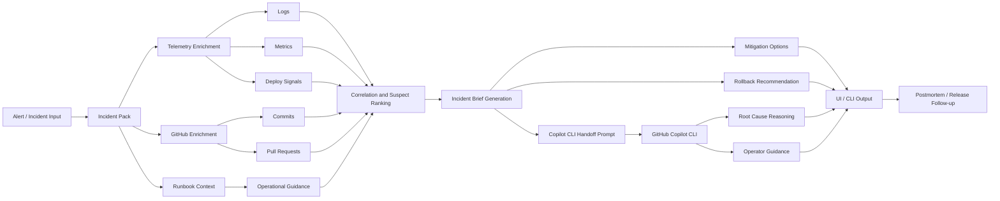

# Copilot SRE Architecture

## Product idea

Copilot SRE is a terminal-native incident commander that sits above GitHub Copilot CLI.

Instead of asking Copilot a vague question like "why is prod broken?", the system assembles an incident context bundle first:

- recent deploys
- active alerts
- key metric regressions
- dominant log patterns
- relevant runbooks
- recent commits

It then turns that evidence into a structured investigation brief and an SRE-grade Copilot prompt.

## Architecture diagram



This is the core product idea in one sentence:

Copilot SRE assembles operational context first, then uses Copilot CLI as the reasoning engine on top of that context.

## Core loop

1. Collect incident evidence
2. Normalize evidence into a shared incident model
3. Rank likely suspects
4. Generate next actions and investigation brief
5. Hand structured context to Copilot CLI
6. Capture the response for operator review

## MVP components

### 1. Incident loader

Current state:
- local JSON incident pack

Future connectors:
- Azure Monitor alerts
- Azure Application Insights traces
- GitHub deployments and commits
- PagerDuty incidents
- runbook registries

### 2. Analysis engine

Responsibilities:
- detect metric regressions
- correlate incident start with recent deploys
- identify dominant error patterns from logs
- produce a ranked suspect list
- generate recommended next actions

This is intentionally heuristic-first for the MVP so the demo is explainable.

### 3. Prompt builder

The prompt builder converts incident evidence into a consistent Copilot input with:

- incident summary
- symptoms
- suspects and evidence
- recommended actions
- runbooks
- timeline

This is the main leverage point: Copilot starts with a compressed operational briefing instead of raw noise.

### 4. Copilot runner

If `copilot` is installed, Copilot SRE can invoke:

```bash
copilot -p "<generated prompt>"
```

This keeps Copilot CLI as the reasoning interface while Copilot SRE acts as the context and orchestration layer.

## Why this is innovative

Most "AI for ops" demos do one of two things poorly:

- they are a chat UI with weak evidence gathering
- they are a dashboard with no real action path

Copilot SRE is different:

- terminal-first
- evidence-backed
- optimized for high-pressure incident flow
- designed to pair with Copilot CLI, not replace it

## Near-term roadmap

### Phase 1
- richer scoring heuristics
- multiple sample incidents
- rollback recommendation generation
- issue and PR draft generation

### Phase 2
- Azure connector package
- GitHub connector package
- live evidence polling during an incident
- postmortem drafting with mitigation verification

### Phase 3
- MCP-backed retrieval
- multi-agent mode: investigator, mitigator, reviewer
- team memory for recurring incident patterns
